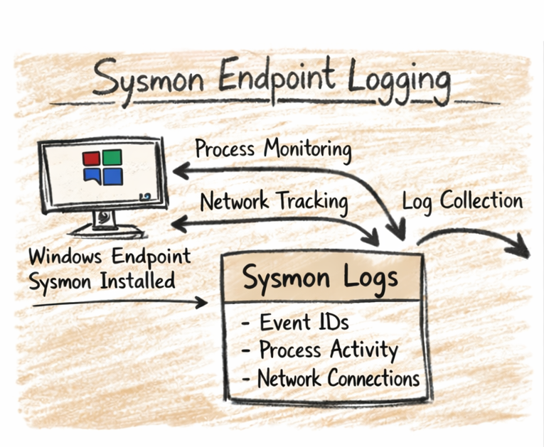

#  Windows Endpoint Hardening + Sysmon Logging

##  Overview
This project demonstrates how to harden a Windows endpoint and configure **Sysmon** for detailed system activity logging. It integrates logs with **Wazuh SIEM** to detect suspicious behavior and strengthen endpoint security.

---

##  What I Did
- Installed Sysmon and applied the **SwiftOnSecurity configuration**
- Enabled detailed logging for:
  - Process creation
  - Network connections
  - Registry changes
  - File creation
- Connected the endpoint to **Wazuh SIEM**
- Triggered test events (PowerShell, simulated attacks)
- Verified Sysmon logs flowing into Wazuh
- Analyzed alerts and patterns for anomalies

---

##  Skills Demonstrated
Sysmon • Windows Hardening • Logging & Monitoring • Detection Engineering • Wazuh SIEM • Threat Analysis

---
---

## Wazuh SIEM Pipeline (Terminal View)

##  Why I Made This
I built this visual to clearly show how Sysmon telemetry moves through the Wazuh SIEM pipeline—from collection on the endpoint to alert investigation in the dashboard. It demonstrates my understanding of log ingestion, detection logic, and how each component contributes to the overall security workflow.

##  How I Created It
I mapped out the full event flow manually using ASCII formatting, then rendered it as a terminal-style screenshot to make it look authentic and aligned with how I actually work in my lab. This approach keeps the visual simple, believable, and easy to reference directly inside the README.

## Project Image

---

## Folder Structure
